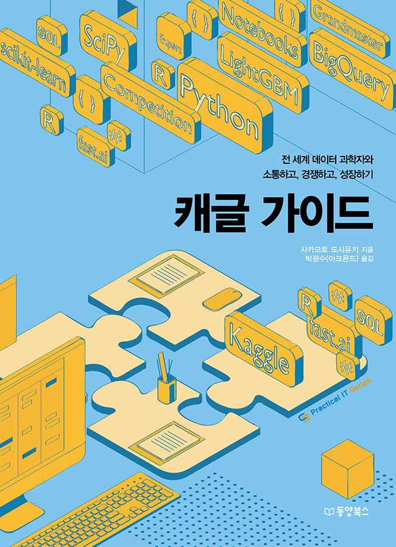

# 『캐글 가이드: 전 세계 데이터 과학자와 소통하고, 경쟁하고, 성장하기』

동양북스 『캐글 가이드: 전 세계 데이터 과학자와 소통하고, 경쟁하고, 성장하기』의 깃허브 저장소입니다.

## 구매하기
[교보문고]() | [YES24]() | [알라딘]() | [인터파크]() | [반디앤루니스]()

## 책 소개
**전 세계 데이터 과학자와 경쟁하면서 실력을 키우는 플랫폼 캐글!**  
**캐글에서 활동하고 싶은 데이터 과학자를 위한 ‘얇지만 내공 있는 책’**

캐글은 전 세계 데이터 과학자가 모여 자신의 실력을 겨루고 상금과 명성을 얻는 경진 대회 플랫폼으로 알려져 있습니다. 그런데 캐글은 단순히 경진 대회만 열리는 공간이 아닙니다. 데이터 과학을 공부하는 공간, 다양한 기술과 지식을 공유하는 공간, 회사에 필요한 인재를 찾는 공간 등 경진 대회 이외에도 유용한 서비스가 많습니다. 캐글을 데이터 과학자의 ‘포털 사이트’라고 소개하는 사람이 있는 이유이기도 합니다.

이 책은 캐글을 처음 접하는 사람이 캐글에서 무엇을 해야 하는지를 압축해서 알려주는 가이드입니다. 경진 대회에 참가하는 요령과 주요 사례 소개는 기본이고, 자칫 놓치기 쉬운 유용한 캐글 서비스를 알려줍니다. 또한 여러 데이터 과학자와 소통하는 방법과 캐글 고수가 되는 노하우도 소개합니다. 이 책을 읽은 후에는 캐글이라는 플랫폼에서 효율적으로 활동하는 방법을 자연스럽게 익힐 것입니다.

## 기타 사항
캐글 API를 설치하려는 목적으로 파이썬 개발 환경을 설치하려는 분은 [이 문서](./readme/pythoninstall.md)를 참고하기 바랍니다.

정오표는 [이곳](./readme/errata/errata.md)을 참고하기 바랍니다.