# 파이썬 개발 환경과 필요한 라이브러리만 설치
아나콘다는 프로젝트에 필요 없는 파이썬 라이브러리까지 한꺼번에 설치한다는 단점이 있습니다. 만약 여러분에게 꼭 필요한 파이썬 라이브러리만 설치하고 싶다면 이 문서를 참고합니다.

## 윈도우

**01** [파이썬 공식 사이트](https://www.python.org)에 접속합니다. `[Download] > [Download for Windows]`에서 `<Python 3.7.4>`를 선택해 파이썬 개발 환경 설치 파일을 다운로드합니다.

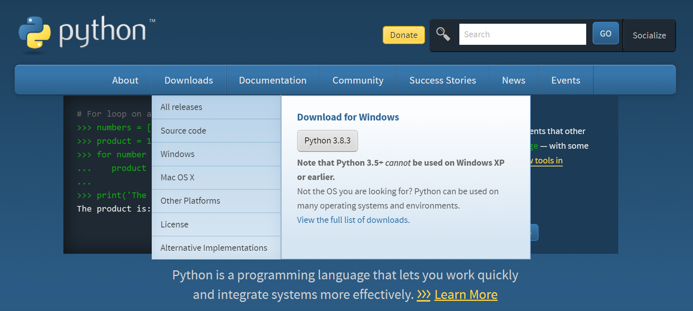

만약 64비트 파이썬 개발 환경 설치 파일을 다운로드하려면 [Python 3.x.x](https://www.python.org/downloads/release/python-3xx/)(현재는 [https://www.python.org/downloads/release/python-374/](https://www.python.org/downloads/release/python-374/))에 접속한 후 맨 아래에 있는  `[Files]` 항목에서 `[Windows x86-64 executable installer]`를 눌러 다운로드합니다.

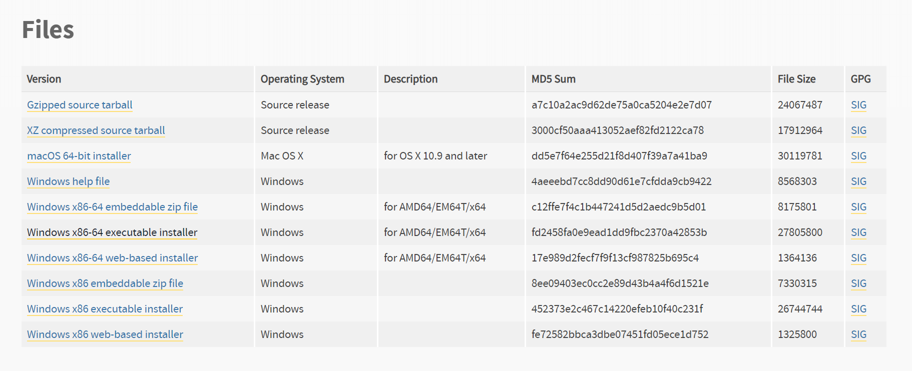

**02** 다운로드한 파이썬 개발 환경 설치 파일(python-3.x.x.exe 혹은 python-3.x.x-amd64.exe)을 실행합니다. 처음 창이 열렸을 때 `[Install Now]`는 파이선 개발 환경이 지정하는 경로에 파이썬을 설치합니다. `[Customize installation]`은 사용자가 설치 옵션을 지정해서 파이썬을 설치합니다. `[Install launcher for all users (recommended)]`는 윈도우의 모든 사용자가 py 파일을 실행할 할 수 있는 런처를 설치합니다. 옵션을 선택한 상태 그대로 놔둡니다. `[Add Python 3.x to PATH]`는 윈도우의 어떤 경로든 파일을 실행할 수 있는 PATH에 파이썬 개발 환경 폴더를 추가한다는 것입니다. 해당 옵션 역시 선택합시다.

여기에서는 `[Customize installation]`를 선택해 설치를 계속 진행합니다. 구체적인 설치 옵션을 설명하려는 것입니다.

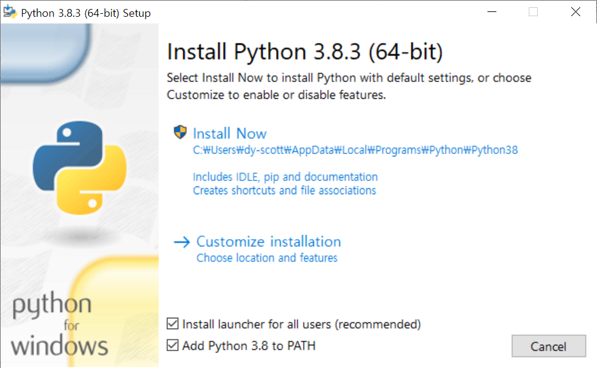

**03** 설치할 때의 옵션을 지정하는 창이 등장합니다. 각 설정 항목을 구체적으로 설명하면 다음과 같습니다.

* **Documentation**: 파이썬 사용에 도움을 주는 각종 문서 파일을 함께 설치할 것인지 정합니다. 기본적으로는 선택한 상태 그대로 둡니다.
* **pip**: 파이썬의 각종 라이브러리나 패키지를 설치하는 명령어인 `pip`를 함께 설치할 것인지 정합니다. 꼭 선택한 상태 그대로 둡니다.
* **tcl/tk and IDLE**: Tkinter 및 IDLE 개발 환경을 설치할 것인지 정합니다. Tcl은 Tool Command Language를 의미하며 파이썬의 기반인 스크립트 언어입니다. Tk는 Tcl으로 데스크톱 애플리케이션을 개발하는 그래픽 사용자 인터페이스(GUI) 도구입니다. Tkinter는 Tcl/Tk를 파이썬에 사용할 수 있도록 한 Lightweight GUI 모듈입니다. 파이썬의 기본 IDE인 IDLE은 Tkinter로 개발한 것이므로 이를 함께 설치하는 것입니다. 기본적으로 설치한 상태 그대로 둡니다.
* **Python test suite**: 파이선 표준 라이브러리와 테스트 세트를 설치할 것인지 정합니다. 기본적으로 선택한 상태 그대로 둡니다.
* **py launcher**, **for all users (requires elevation)**: `[py launcher]`는 파이썬 py 파일을 실행하는 py launcher를 설치할 것인지 정합니다. `[for all users (requires elevation)]`는 모든 사용자가 파이썬을 사용할 것인지 선택합니다. 즉, 두 항목을 조합하면 모든 사용자가 파이썬을 쉽게 시작할 수 있도록 'py' 파일을 실행하는 프로그램을 설치한다는 뜻입니다.

특별한 이유가 없다면 모든 항목을 선택한 후 `<Next>` 버튼을 누릅니다.

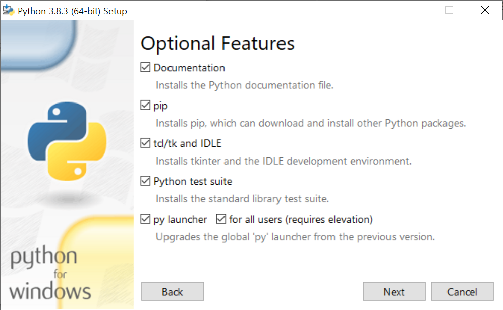

**04** 고급 설치 옵션을 선택합니다. 각 설정 항목을 구체적으로 설명하면 다음과 같습니다.

* **Install for all users**: 윈도우의 모든 사용자가 파이썬을 이용하는 상태로 설치합니다. 기본적으로 해당 항목을 선택해 설치합니다.
* **Associate files with Python (requires the py launcher)**: py launcher가 설치되었다면 윈도우에서 파이썬 파일을 실행할 프로그램으로 py launcher를 설정합니다. 기본적으로 해당 항목을 선택해 설치합니다.
* **Create shortcuts for installed applications**: 파이썬 개발 환경을 설치할 때 의 윈도우 바로 가기 파일을 바탕화면에 생성합니다. 해당 항목은 선택해도 되고 선택하지 않아도 됩니다.
* **Add Python to environment variables**: 파이썬 실행 파일을 윈도우의 환경 변수에 등록합니다. 기본적으로 해당 항목을 선택해 설치합니다.
* **Precompile standard library**: 파이썬 표준 라이브러리를 바로 사용할 수 있도록 미리 컴파일해둡니다. 기본적으로 해당 항목을 선택해 설치합니다.
* **Download debugging symbols**: 파이썬 프로그램을 수정할 때 필요한 디버깅 기호를 사용할 수 있도록 다운로드해 설치합니다. 기본적으로 해당 항목을 선택해 설치합니다.
* **Download debug binaries (requires VS 2015 or later)**: 마이크로소프트 비주얼 스튜디오 2015 이상에서 사용하는 디버그 바이너리를 다운로드해 설치합니다. 비주얼 스튜디오를 사용해 파이썬을 디버깅하지 않는다면 해당 항목을 선택할 필요가 없습니다.

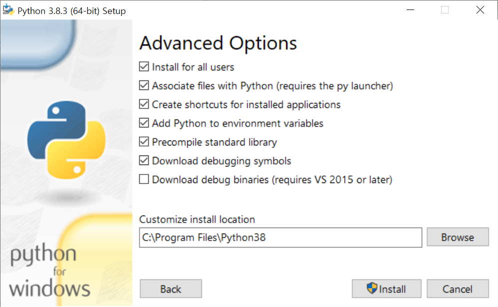

`[Customize install location]`에서는 파이썬 개발 환경을 설치할 폴더를 지정합니다. 현재 지정된 폴더 그대로 설치하기를 권합니다. 설치할 폴더를 바꾸려면 `<Browse>` 버튼을 누른 후 열리는 '폴더 찾아보기' 창에서 원하는 폴더 경로를 선택해도 됩니다. 원하는 폴더를 미리 만들지 않았다면 `<새 폴더 만들기>` 버튼을 눌러서 폴더를 생성할 수 있습니다.

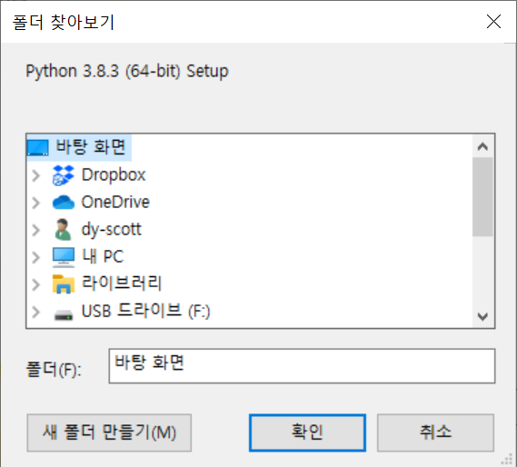

모든 항목의 설정이 끝났다면 `<Install>` 버튼을 누릅니다.

**05** 파이썬 개발 환경을 설치합니다.

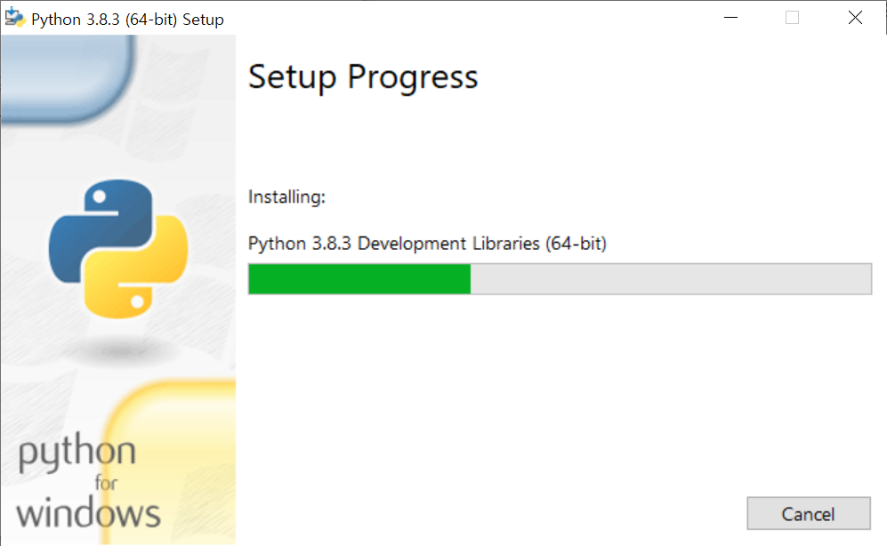

**06** 파이썬 개발 환경을 설치를 완료했습니다. `[online tutorial]`을 누르면 파이썬 공식 사이트의 튜토리얼 웹 페이지로 이동합니다. `[what's new]`를 누르면 이번에 설치한 파이썬 3.x 버전의 주요 특징을 설명하는 웹 페이지로 이동합니다. `<Close>` 버튼을 눌러 설치를 마칩니다.

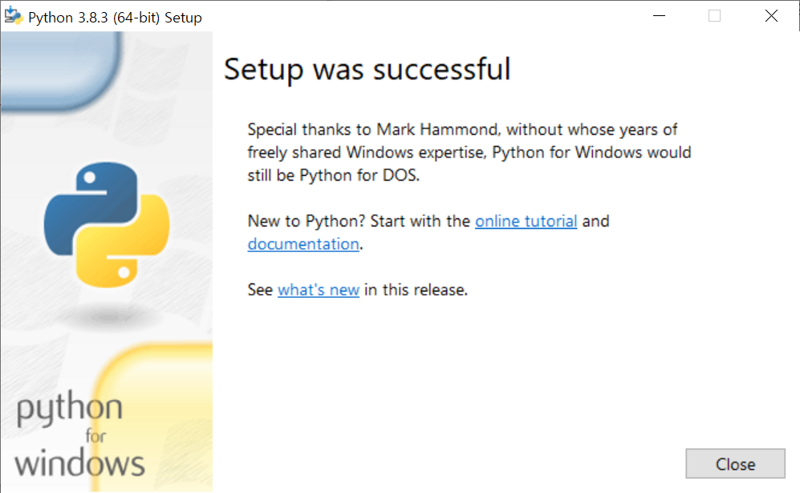

## macOS

**01** [파이썬 공식 사이트](https://www.python.org)에 접속합니다. `[Download] > [Download for Windows]`에서 `<Python 3.7.4>`를 선택해 파이썬 개발 환경 설치 파일을 다운로드합니다.

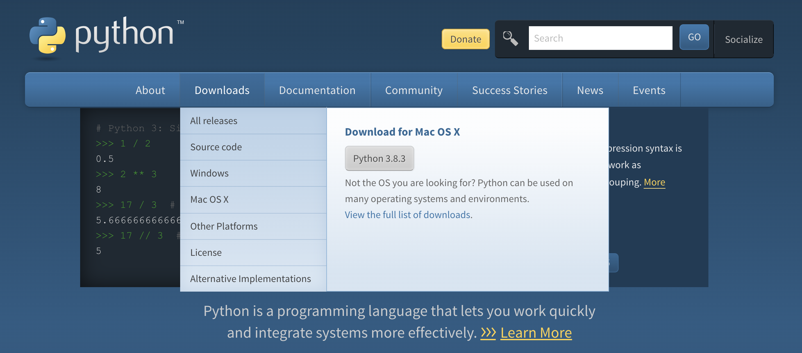

만약 64비트 파이썬 개발 환경 설치 파일을 다운로드하려면 [Python 3.x.x](https://www.python.org/downloads/release/python-3xx/)(현재는 [https://www.python.org/downloads/release/python-374/](https://www.python.org/downloads/release/python-374/))에 접속한 후 맨 아래에 있는  `[Files]` 항목에서 `[macOS 64-bit installer]`를 눌러 다운로드합니다.

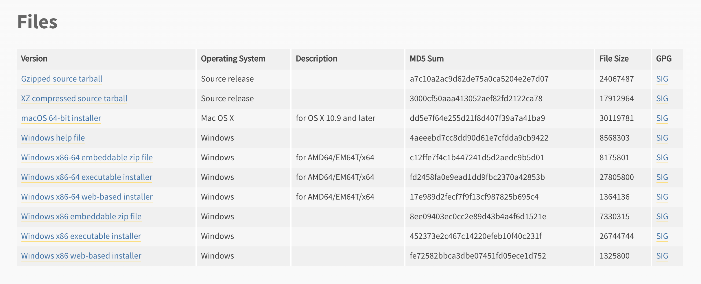

**02** 다운로드한 파이썬 개발 환경 설치 파일(python-3.x.x-macosx10.9.pkg)을 실행합니다. 처음 창이 열렸을 때 등장하는 `[소개]`는 파이썬 개발 환경의 소개와 설치하는 파이썬 버전의 특징을 간략하게 소개합니다. 여유 시간이 있다면 읽어보는 것도 좋습니다. `<계속>` 버튼을 누릅니다.

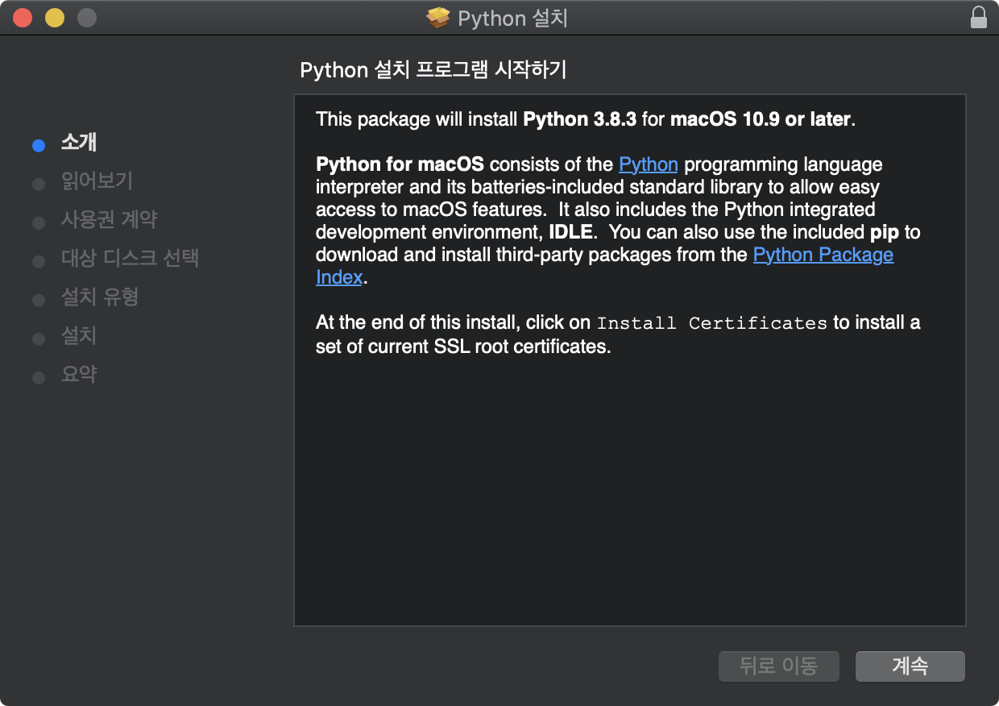

**03** `[읽어보기]`에서는 해당 파이썬 버전을 macOS에 설치할 때 알아야 할 사항을 간략하게 설명합니다. 파이썬 32비트와 64비트 버전의 차이, 보안 인증에 사용하는 OpenSSL 관련 설명, 기타 변경 사항, 파이썬 2.x와 3.x를 동시에 사용하는 방법 등을 소개합니다. 여유 시간이 있다면 읽어보는 것도 좋습니다. 해당 내용을 프린트하려면 `<프린트>` 버튼을 누르고 PDF로 저장하려면 `<저장>` 버튼을 누릅니다. 설치를 계속 진행하려면 `<계속>` 버튼을 누릅니다.

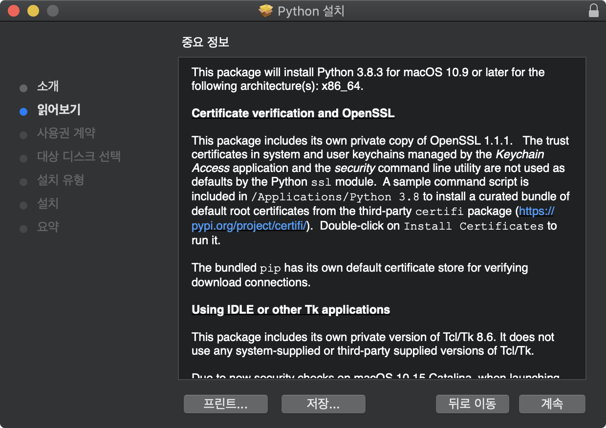

**04** `[사용권 계약]`에서는 파이썬 개발 환경의 라이선스 조항에 동의할 것이냐는 내용입니다. 당연히 해당 조항에 동의해야 사용할 수 있습니다. 시간이 된다면 스크롤창에 있는 파이썬 라이선스 조항을 읽어보기 바랍니다.

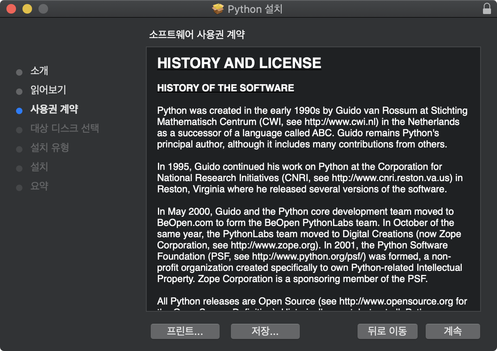

`<계속>` 버튼을 누르면 소프트웨어 사용권 계약의 이용 약관에 동의하는 창이 등장합니다. `<동의>` 버튼을 누릅니다. `<사용권 계약 읽기>` 버튼을 누르면 이전 화면으로 돌아갑니다.

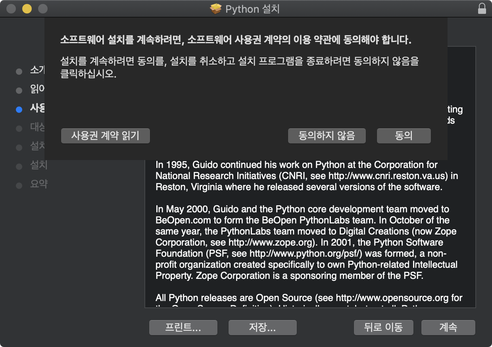

**05** `[대상 디스크 선택]`은 건너뛰고 자동으로 현재 사용자의 macOS가 설치된 디스크를 선택합니다. 이어서 `[설치 유형]`으로 이동하면 크게 두 가지 항목에서 설치 옵션을 선택할 수 있습니다.

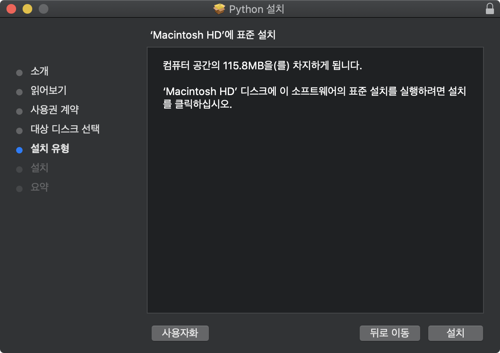

**06** `<사용자화>` 버튼을 누르면 다음 소개하는 항목을 선택하거나 선택하지 않을 수 있습니다.

* **Python Framework**: 파이썬 개발 환경의 핵심인 파이썬 인터프리터와 표준 라이브러리를 설치합니다. 무조건 설치해야 하므로 선택한 상태로 선택 해제할 수 없도록 비활성화되어 있습니다.
* **GUI Applications**: 파이썬 개발 도구인 IDLE, py launcher, 예제와 데모 등을 설치합니다. 선택해 설치할 것을 권합니다.
* **UNIX command-line tools**: 이전 버전(2.x)과의 호환성을 유지하려고 유닉스 도구를 /usr/local/bin에 설치합니다. macOS는 파이썬 2.x 버전이 설치되어 있으므로 선택해 설치할 것을 권합니다.
* **Python Documentation**: 파이썬 공식 문서를 설치합니다. 선택해 설치하는 것을 권하지만 설치하지 않아도 괜찮습니다.
* **Shell profile updater**: 셸 도구(macOS라면 기본 도구는 터미널)에서 파이썬 개발 환경을 사용할 수 있도록 합니다. 선택해 설치하는 것을 권합니다.
* **Install or upgrade pip**: 파이썬 패키지나 라이브러리를 설치하는 도구인 `pip`를 설치하거나 업그레이드합니다. 선택해 설치하는 것을 권합니다.

대상 디스크를 선택하는 **07** 과정을 실행하려면 `<표준 설치>` 버튼을 눌러 **05** 과정으로 돌아갑니다. 현재 macOS가 설치된 디스크에 파이썬을 바로 설치하려면 `<설치>` 버튼을 누릅니다.

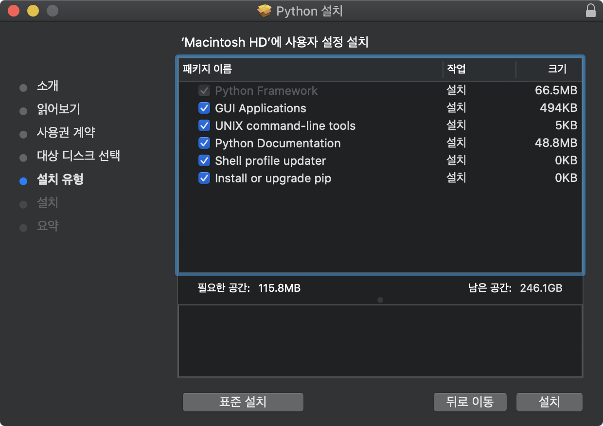

**07** 다시 **05** 과정으로 돌아와 `<설치 위치 변경>` 버튼을 누르면 `[대상 디스크 선택]` 항목으로 들어갑니다. 사실 파이썬은 macOS가 설치된 디스크 이외에 다른 디스크에 파이썬을 설치할 수 없으므로 `[대상 디스크 선택]`이 큰 의미가 없습니다. `<계속>` 버튼을 눌러 **05** 과정으로 돌아오면 `<설치>` 버튼을 누릅니다.

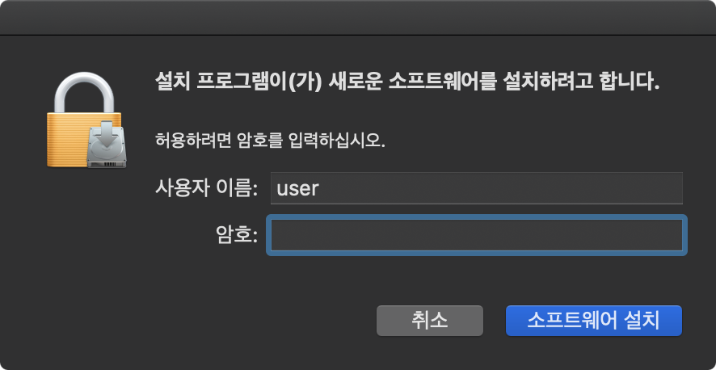

**08** 본격적으로 설치하기 전 "설치 프로그램이(가) 새로운 소프트웨어를 설치하려고 합니다"라는 메시지가 등장합니다. `[사용자 이름]`이 여러분이 로그인한 macOS 사용자 계정 이름인지 확인하고 혹시 아니라면 해당 이름으로 수정합니다. `[암호]`에는 로그인 암호를 입력한 후 `<소프트웨어 설치>` 버튼을 누릅니다.


터치바 기반의 맥북 프로를 사용한다면 지문을 입력해서 바로 설치할 수도 있습니다.

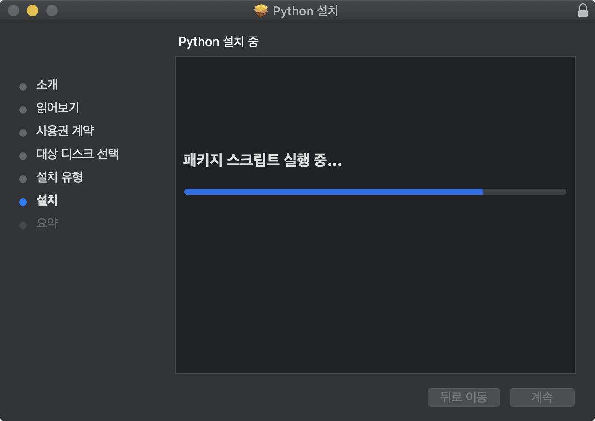

**09** `[설치]`에서 파이썬 개발 환경을 설치합니다. 사용자의 컴퓨터 성능에 따라 설치 시간은 차이가 있습니다.

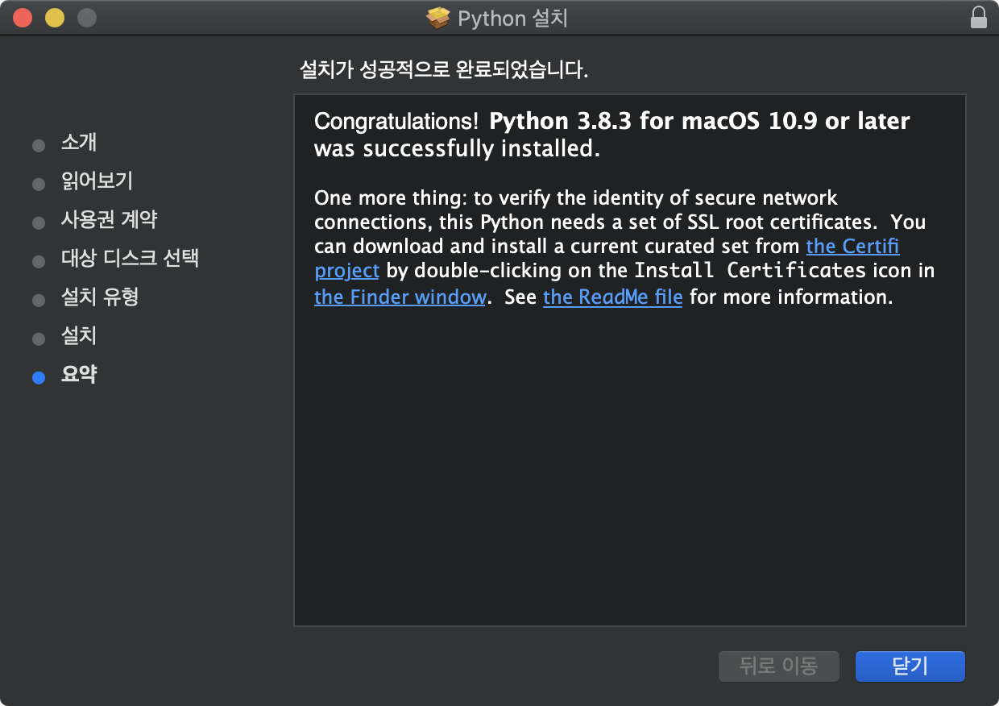

**10** 파이썬 개발 환경 설치를 완료했습니다. `<닫기>` 버튼을 눌러 설치를 종료합니다.

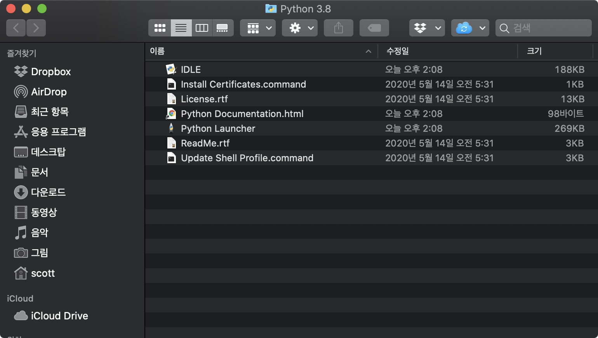

사용자의 macOS 환경에 따라 다음 그림처럼 파이썬 개발 환경 폴더가 바로 열릴 수도 있습니다.


## 파이썬 가상 환경 만들기
파이썬은 다양한 라이브러리나 패키지를 사용하므로 필요한 것만 사용하려면 가상 환경을 만드는 것이 좋습니다. 혹시 서로 간섭할 수 있는 라이브러리나 패키지의 영향을 막을 수 있고, 해당 가상 환경만 지우면 언제나 초기 파이썬 개발 환경을 유지할 수 있기 때문입니다.

**01** 명령 프롬프트 혹은 터미널에서 파이썬 가상 환경을 실제로 설치할 폴더(혹은 디렉터리)의 바로 상위 폴더로 이동합니다. 그리고 다음 명령을 실행합니다.

```shell
# 윈도우
> python -m venv 가상환경디렉터리이름

# macOS
$ python3 -m venv 가상환경디렉터리이름
```

**02** 다운로드한 예제 파일 안 py 디렉터리와 jupyter 디렉터리를 방금 만든 '가상 환경 디렉터리 이름'에 복사해둡니다.

**03** 다음 명령을 실행해 파이썬 가상 환경으로 진입합니다.

```shell
# 윈도우 명령 프롬프트
> .\가상환경디렉터리이름\Scripts\activate.bat 

# 윈도우 파워셸
> .\가상환경디렉터리이름\Scripts\Activate.ps1

# macOS
$ source ./가상환경디렉터리이름/bin/activate
```

참고로 '윈도우 파워셸'은 기본적으로 외부 스크립트를 실행해서 생기는 보안 문제를 차단하기 위해 스크립트를 실행하지 않도록 설정했습니다. 만약 앞 명령으로 가상 환경을 실행할 수 없다면 '관리자로 실행'으로 윈도우 파워셸을 실행한 후 다음 명령을 실행해서 외부 스크립트를 실행할 수 있게 바꿉니다.

```shell
> Set-ExecutionPolicy Unrestricted
```

가상 환경을 종료할 때는 다음 명령을 실행합니다.

```shell
$ deactivate
```

## 필요한 파이썬 라이브러리와 주피터 노트북 설치하기
이 책에서 사용하는 파이썬 모듈, 라이브러리는 다음과 같습니다.

* sckit-learn
* numpy
* math
* random
* collections
* tensorflow
* scipy
* PIL

`math`, `random`, `collections`는 파이썬에서 기본적으로 제공하는 것이고 `numpy`와 `scipy`는 `scikit-learn`을 설치할 때 함께 설치됩니다. 따라서 실제로 설치할 것은 `scikit-learn`, `tensorflow`, `PIL`과 주피터 노트북(`jupyter notebook`)입니다.

**01** 앞에서 소개한 [파이썬 가상 환경 만들기](https://github.com/wizplan/dl_math_book/blob/master/readme/pythoninstall.md#파이썬-가상-환경-만들기)를 참고해 가상 환경에 진입한 후 `cd 가상환경디렉터리이름` 명령을 실행해 가상 환경 디렉터리로 이동합니다.

**02** 다음 명령을 각각 실행해 `scikit-learn`, `tensorflow`, `PIL`, `jupyter notebook`을 설치합니다.

```shell
$ pip install -U scikit-learn

$ pip install tensorflow

$ pip install jupyter

# PIL 설치
$ pip install pillow
```

참고로 윈도우라면 "You are using pip version X.X.X, however version X.X.X is available. You should consider upgrading via the 'python -m pip install --upgrade pip' command."라는 메시지가 등장할 수 있습니다. `pip`를 최신 버전으로 업그레이드하라고 안내하는 것인데 하지 않아도 프로그램 동작엔 문제가 없습니다. 파이썬을 처음 접한다면 업그레이드하지 않을 것을 권합니다. 간혹 업그레이드했다가 파이썬 가상 환경에서 `pip`를 실행하지 못할 수도 있기 때문입니다. 만약 업그레이드했다가 `pip`를 실행하지 못한다면 해당 가상 환경 디렉터리를 삭제한 후 다시 가상 환경 디렉터리를 만들기 바랍니다.

**03** 파이썬 설치한 라이브러리 및 애플리케이션을 목록화해두면 좋습니다. 다음 명령을 실행합니다.

```shell
$ pip freeze > requirements.txt
```

requirements.txt를 따로 저장해두면 나중에 해당 파일을 이용해 한꺼번에 라이브러리들을 설치할 수 있습니다. 다음 명령을 실행합니다.

```shell
$ pip install -r requirements.txt
```

**04** `cd py` 명령을 실행한 후 `python 예제파일이름.py` 명령을 실행해 각종 예제 파일을 실행할 수 있습니다. 

**05** 가상 환경에서 주피터 노트북을 사용하려면 다음 명령을 실행합니다.

```shell
$ jupyter notebook
```

**06** 웹 브라우저에서 실행한 주피터 노트북 페이지에서 jupyter 디렉터리로 이동한 후 '장번호.ipynb'을 열면 이 책의 주피터 노트북 예제 파일을 실행할 수 있습니다.